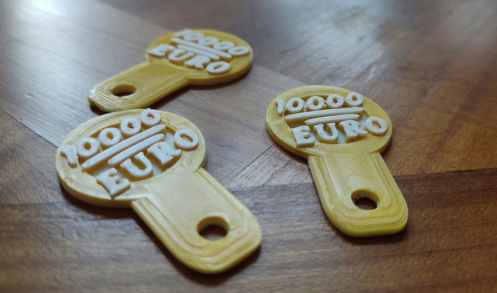
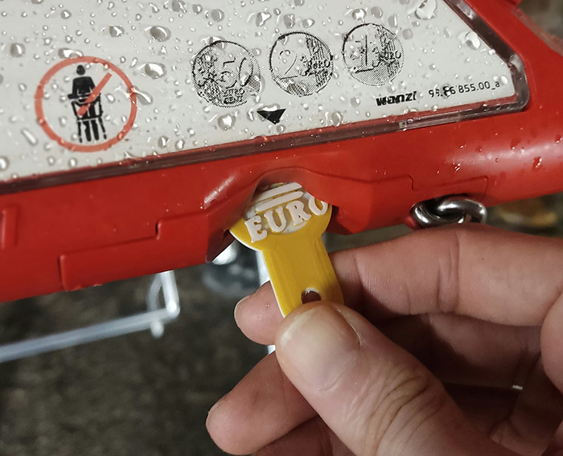
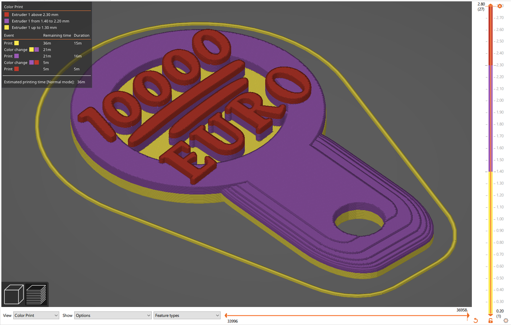

10,000 Euro Coin Trolley / Shopping Cart Token
==============================================

Show off your wealth by unlocking shopping carts with this  Euro coin.

License: CC-BY-NC-SA 4.0

At 25.75mmØ, the recommended file to print is about as wide as a 2 euro coin, and at 2.4mm, about as tall as a 50 cents coin. Most European trolleys are set up to accept 50 cents, 1 euro, and 2 euro coins. If some local shops will only accept a 1 euro coin, you can print the 1 euro version instead.

Prints of this item have been used successfully to liberate multiple shopping carts in France. Using the handle, you might be able to retrieve the token after unlocking some trolleys. **Be responsible and bring it back regardless**.

This is not the easiest item to print, and you will find many simpler trolley token designs online. 

To achieve the intended results, first decide which file to print.

- If thin prints generally come out the intended size
  - and the local shops accept 2 euro coins: `10000 Euro Trolley Token (2 euro coin size).stl`.
  - and the local shops require 1 euro coins: `10000 Euro Trolley Token (1 euro coin size).stl`.
- If thin prints generally come out thinner than the intended size
  - and the local shops accept 2 euro coins: `10000 Euro Trolley Token (2 euro coin size, thicker).stl`.
  - and the local shops require 1 euro coins: `10000 Euro Trolley Token (1 euro coin size, thicker).stl`.

If you don't have precise calipers to verify, you can simply compare a test print with a real coin. If you print this item too thin, the handle will not be robust enough to use on a keychain.

In your slicer, you will need to program **two different color changes**, which may require a custom firmware for your printer to support the [M600 GCode](https://marlinfw.org/docs/gcode/M600.html).

- **Start**: Use white or silver filament.
- **Change 1**: When the inner part of the coin is done printing, swap to yellow or gold filament.
- **Change 2**: When the handle and outer rim are done printing, swap back to the first filament.

Here's how it should look:

You should probably use 100% infill (it makes almost no difference in material used), a small nozzle (0.4mm or less), and a low layer height. I printed the ones you saw in the pictures with PLA, on a 0.4mm nozzle, with 0.1mm layers, on a Creality Ender 3 V2. I also enabled ironing in Prusa Slicer for a smoother finish.

If you print the 1 euro version, I suggest using a smaller nozzle than 0.4mm, or the details won't come out right.

As tempting as it might be to print a sheet of 240,000 Euros for less than 1 Euro worth of filament, I suggest testing a single print in a local store before before you start counterfeiting too much legal tender. 

If you wish to edit it to use a custom logo, try to aim for a similar thickness. Areas that are too thin will be comprised of a single extrusion path, which won't be robust.
Original project made with TinkerCAD: <https://www.tinkercad.com/things/hvNKiy01ciw-10000-euro-v4>.

— Aria Salvatrice