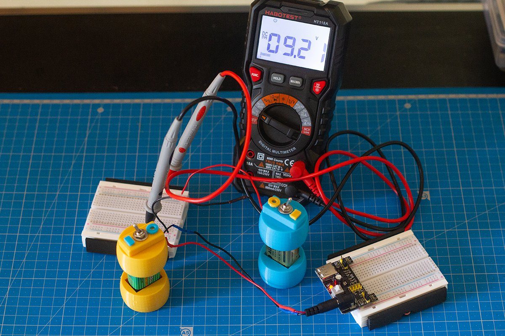
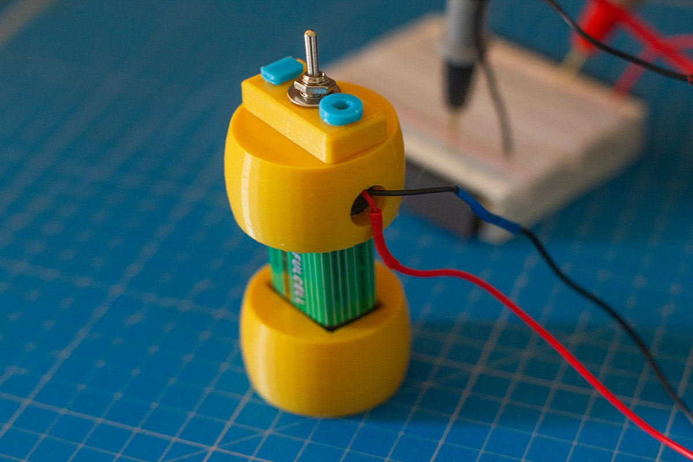
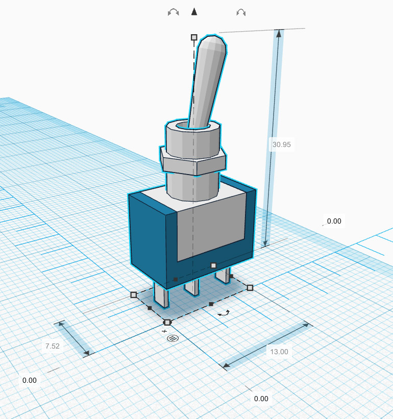
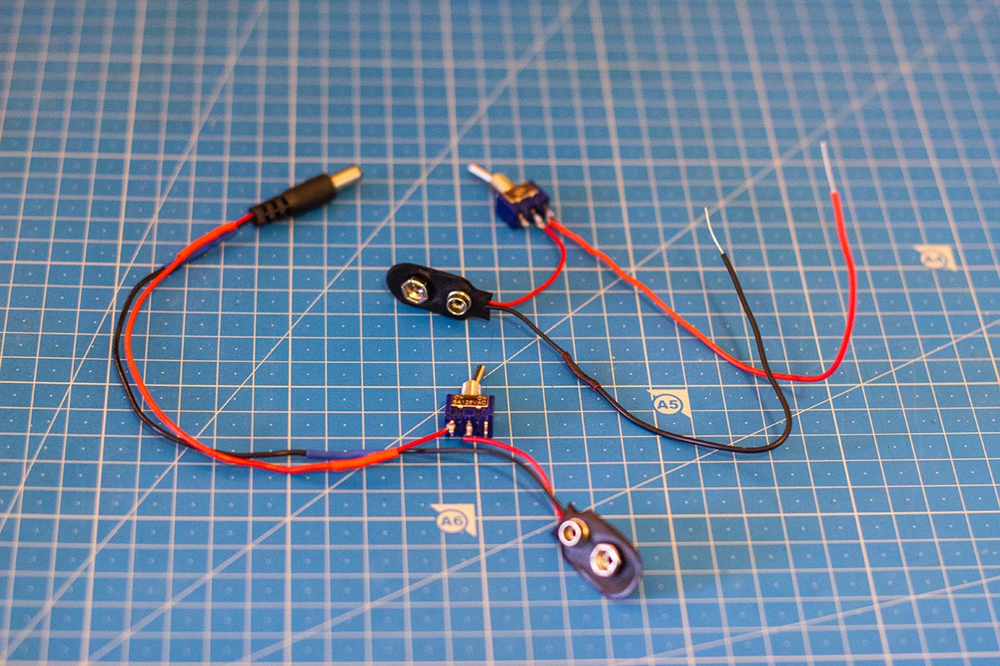
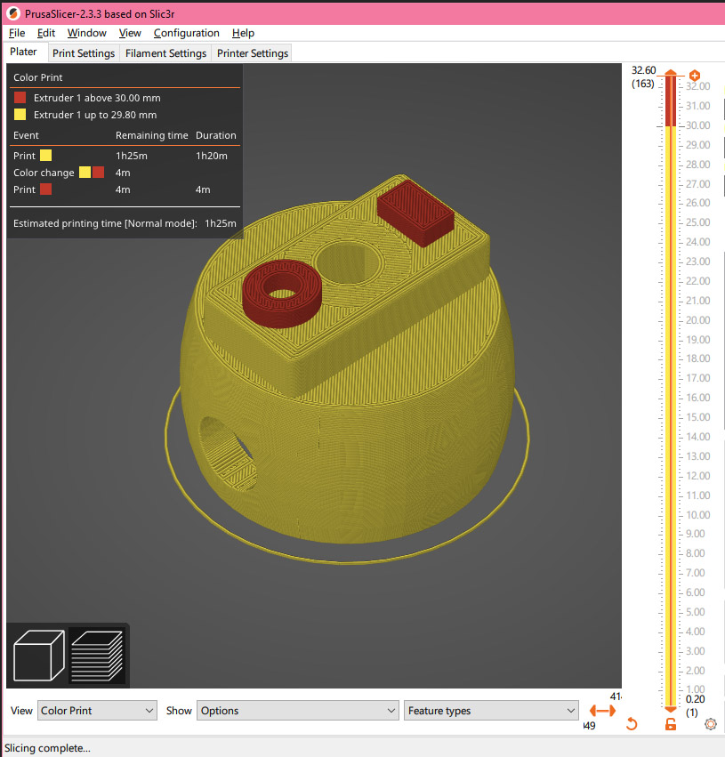
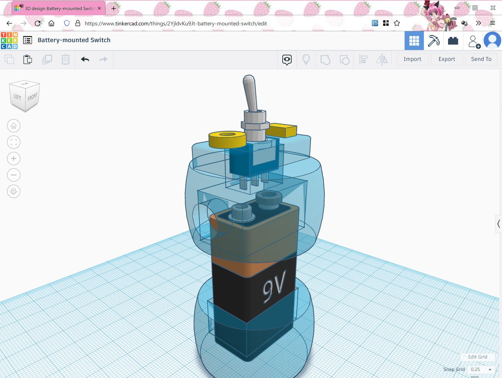
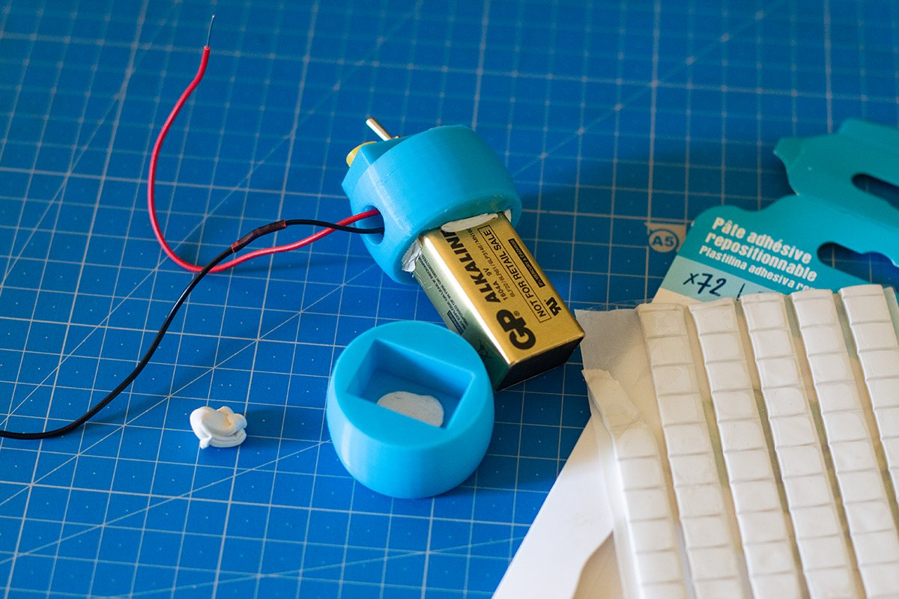

9V Battery holder with built-in switch
======================================

This little base for a 9V battery is ideal to experiment with electronics you want to power cycle frequenly. 

License: CC-BY-NC-SA 4.0

To make it, you will require:

- A 9V battery
- A 9V snap connector. If it has a jack, it should not exceed 10mm in diameter.
- Some reusable adhesive putty
- A MTS-102 SPDT switch with solder terminals that fits:    

First, solder the switch to the snap connector as follows:

Then, prepare the print for both the base and the top with I/O label. For the top, in your slicer, you will need to program **a color change**, which may require a custom firmware for your printer to support the [M600 GCode](https://marlinfw.org/docs/gcode/M600.html).

You should program the change to happen at the height of the I/O letters. Here's how it should look:

You will also find a variant STL file without the I/O label, and a file containing only the I/O label, if you'd like to glue them instead.

Place everything inside the hat as follows: 

Since the print has a lot of tolerance, seal things in place using a bit of reusable adhesive putty:

Here's the original TinkerCAD project: <https://www.tinkercad.com/things/2YjldvKu9Jt-battery-mounted-switch>

—Aria Salvatrice