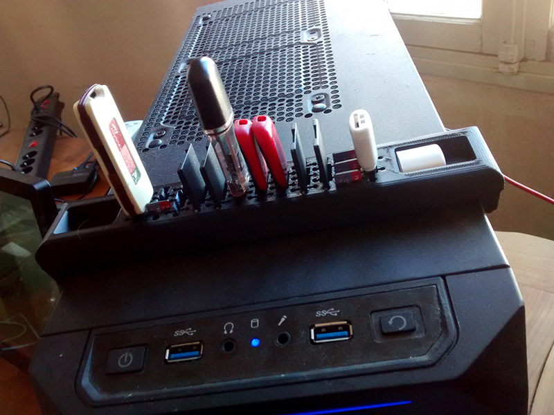
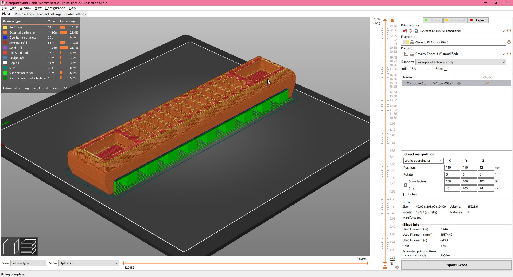

Desktop Computer Combined SD, Micro-SD, and USB Holder [WIP]
======================================================

This universal holder will fit atop a 185 mm wide ATX Tower desktop computer case. The fit isn't tight, it is held in place using a little dab of adhesive putty on both sides.

License: CC-BY-NC-SA 4.0

For the best surface finish, I recommend printing it upright, with supports. 

While this item was made from scratch, it uses the same ingenious design as [IOMAA](https://www.thingiverse.com/iomaa/designs)'s [USB SD SD Mirco Holder Combined](https://www.thingiverse.com/thing:2835728).

The design was created in Blender, in the most inefficient way possible. The original file is included. 

TODO:
- [ ] Beter preview pictures
- [ ] Make size variants. What are the common ATX tower sizes? 

— Aria Salvatrice