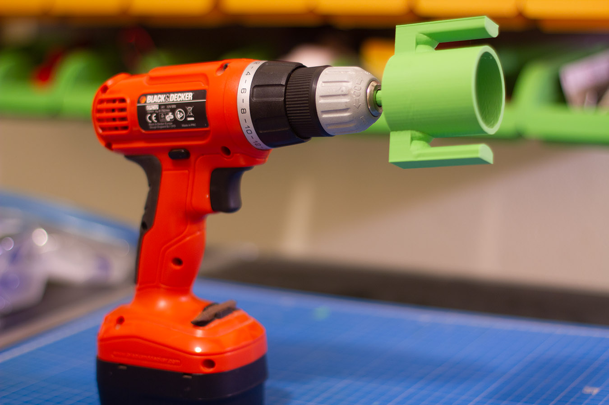
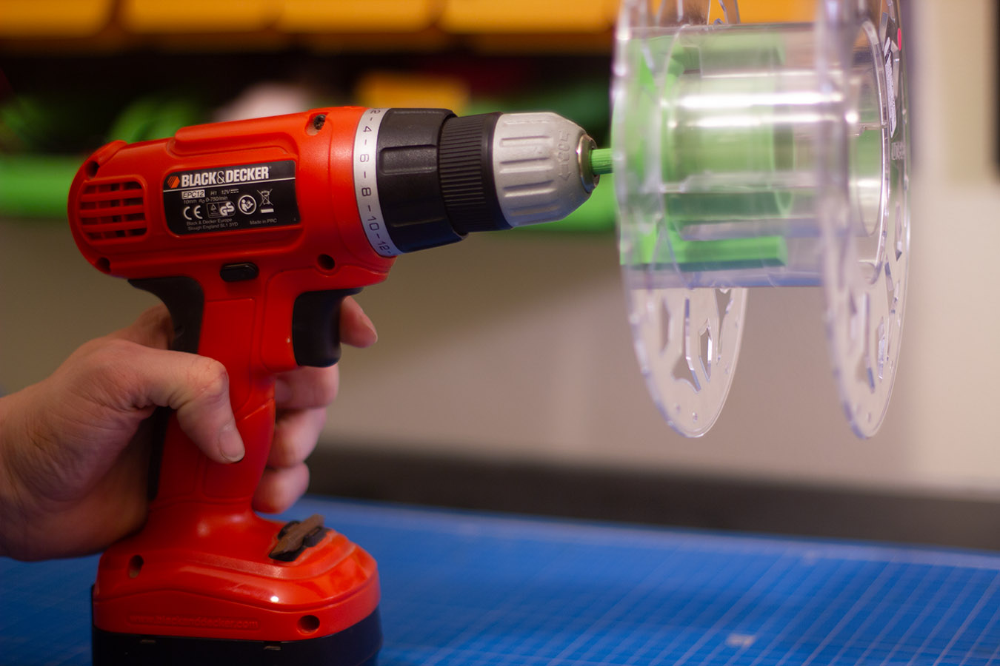
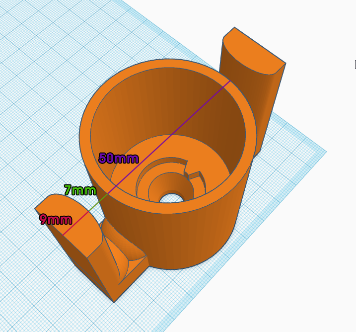
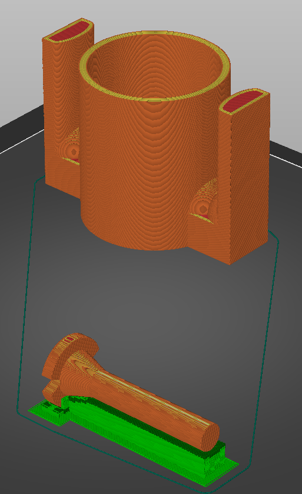
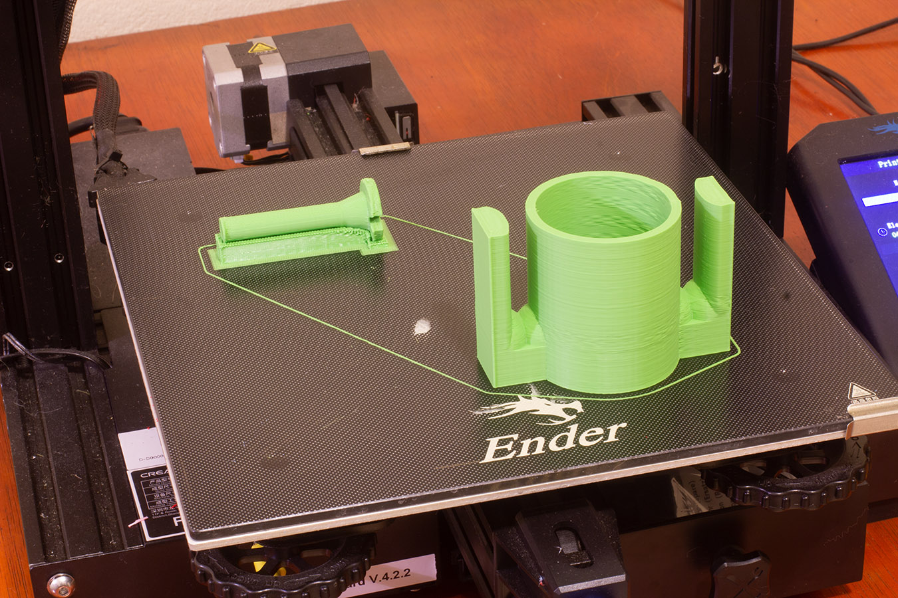
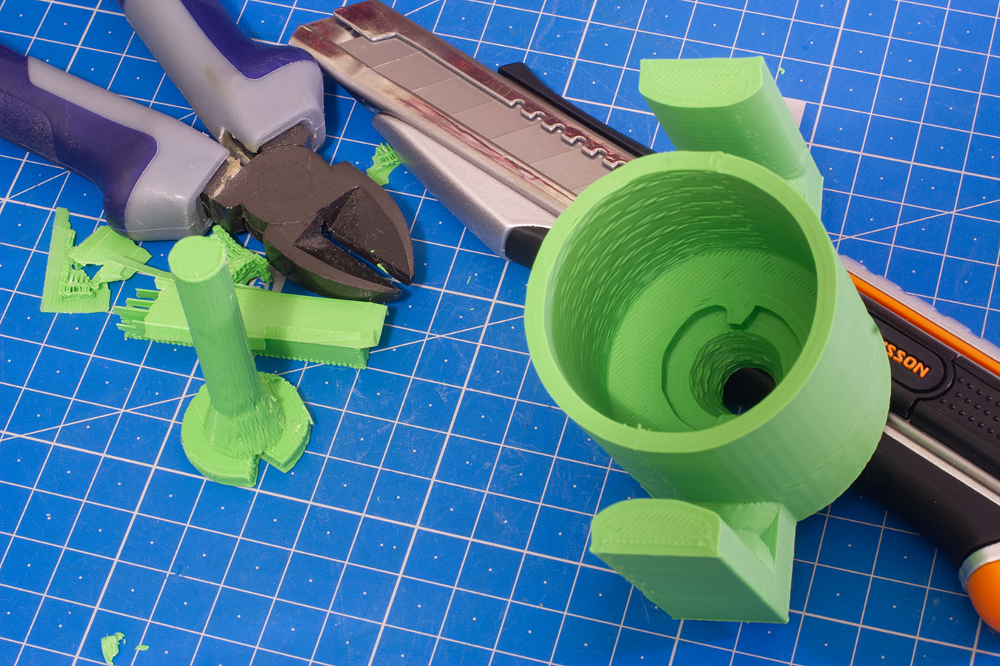
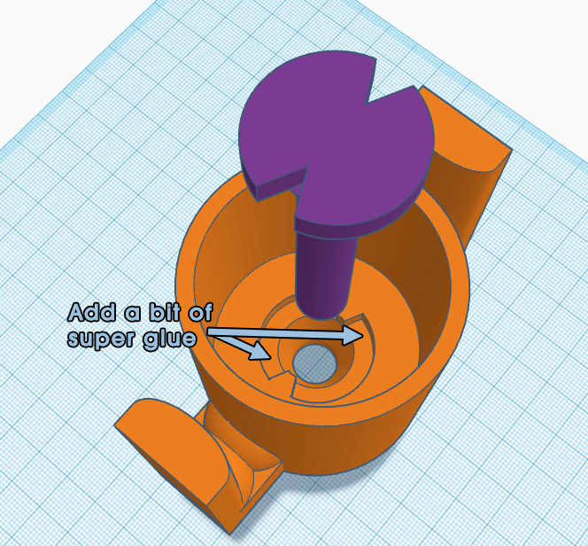

Drill Spool Adapter Bit for Filament Respooling
===============================================

This adapter will fit in multiple brands of 1KG spools, and most cordless drills. I use it to transfer filament from large spools to smaller ones.

License: CC-BY-NC-SA 4.0

It is known to work with these brands of spools:

- Creality PLA
- eSun PLA+
- Amazon Basics PLA

Please let me know about any other brand it's compatible with.

There are the dimensions of the adapter, if you want to measure before you print:

The item is comprised of two parts: shaft and bit. They are glued together using a bit of super glue. PLA works well for both parts. Avoid PETG: the wings would be too brittle and break easily.

Print the shaft horizontally, with supports to increase its strength. If you print it vertically, shearing forces will be parallel to the printed layers, making it weaker. 100% infill suggested. 0.20mm layer heigh is more than good enough.

Print the larger bit that goes into the shaft with the flat part at the bottom. Increase the perimeters a little (4 minimum suggested). 15% infill should suffice. 

    

    

    

After removing the supports, preparing the surface, and testing the fit, use super glue to fasten the parts.

Let it dry, and it's ready to use. Prefer a lightweight cordless drill, and keep it slow. While you won't achieve a neat, professional-looking spool, with the proper technique, you can wind spools that are usable. Still, it's prone to tangling. It takes practice to get acceptable results, and you might get disappointed and waste filament in the process.

There are many atlernatives to this item you can try out if it's not working out for you, such as [this adapter](https://www.thingiverse.com/thing:3603712) if you can print TPU.

Wanna edit it? [I made it with Tinkercad](https://www.tinkercad.com/things/fvPlmX7OrCp-drill-adapter-v7). Sorry. I'll try to free myself of Autodesk stuff and learn a proper alternative next item, I promise. 

— Aria Salvatrice