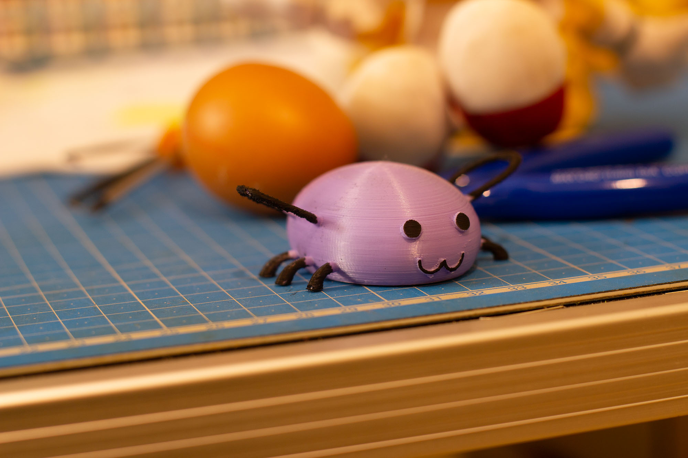
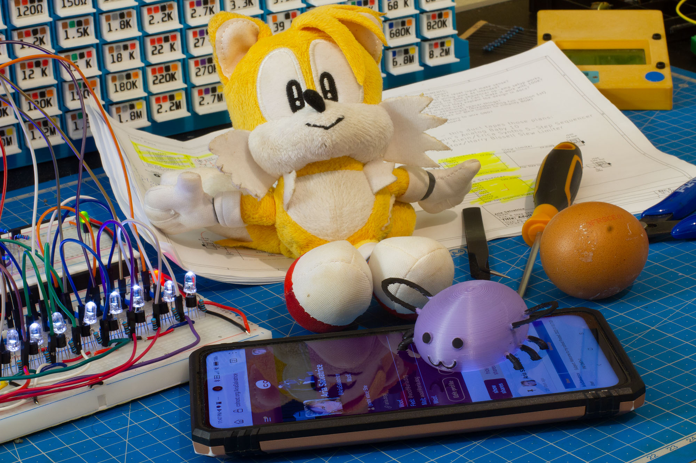
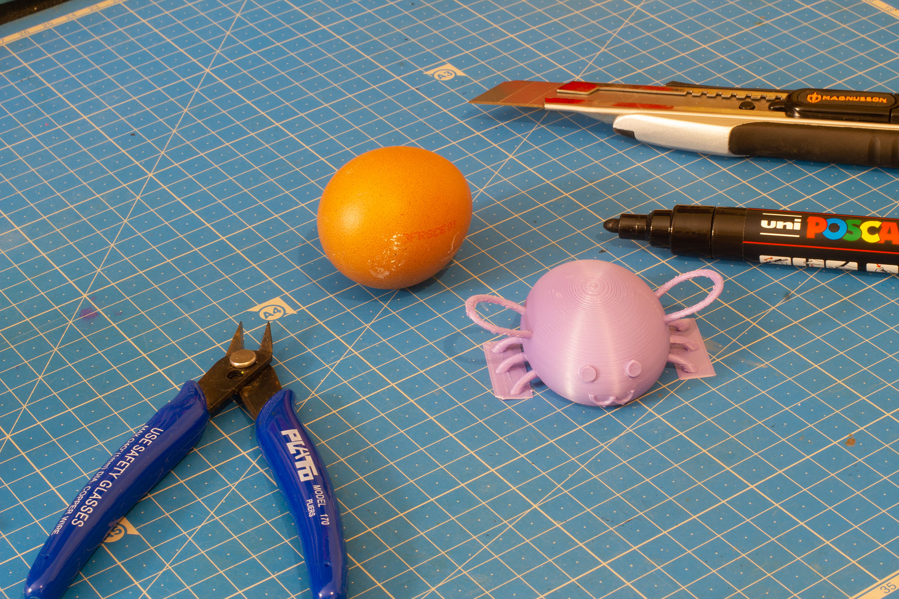

Eggbug Figure - Cohost Mascot
=============================

It's Eggbug! Everyone's favorite cool bug, and the mascot of [Cohost](https://cohost.org).

License: CC-BY-NC-SA 4.0. Eggbug belongs to [Anti Software Software Club LLC](https://antisoftware.club/), and this item is built with the understanding they actively encourage [fan creations using this character](https://cohost.org/eggbug).

The figurine is 75mm×59mm×25mm (Tails plushie provided for scale). I do not recommend printing it much smaller than this,  it would be very difficult to paint. 10% infill should suffice, I used a Gyroid pattern. It's safe to print without additional supports.

I recommend printing the file **Eggbug - leg support.stl**: It includes a small support for the legs, which are hard to print otherwise. After printing, you can remove it easily with a hobby knife. **Eggbug - no support.stl** is also provided.

Every Eggbug is beautiful no matter their color, but the canonical Eggbug is a mauveish reddish purple. 

To paint the features, I used a POSCA acrylic paint marker. 

This item was make using Blender, the original file is included.

— Aria Salvatrice