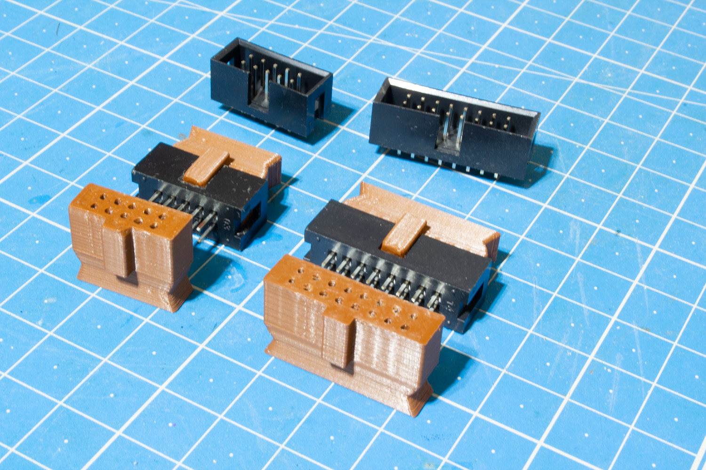
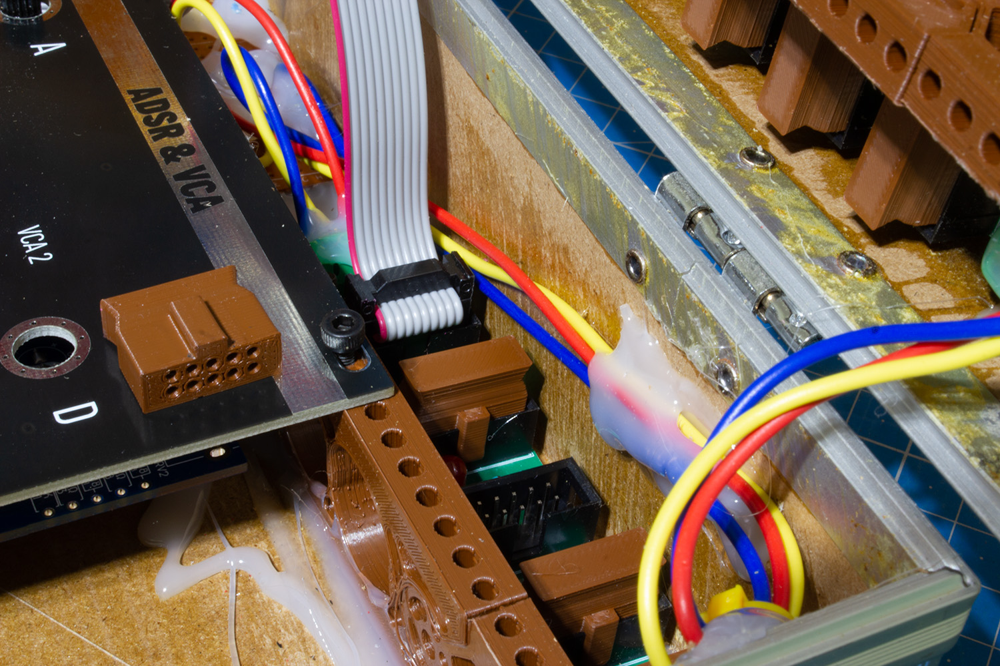

# Parametric IDC Connector Cover for 10-pin and 16-pin Shrouded Eurorack Header

Plug for unused IDC connectors to prevent accidental short-circuits on modular synthesizer power rails.

License: CC-BY-NC-SA 4.0.

Eurorack synths use busboards with IDC power headers to distribute power across a system. If there's any risk a patchcable could come into contact with them and short pins, those little caps might grant you a sense of relief during your more agitated patching sessions. Normally you'd solve the problem with blank plates instead, but punk-ass DIY builds don't do normal.

Print without supports in the default orientation. The size might be a bit tight for a good grip, especially if your z-offset is poorly tuned: after printing, it might be a good idea to blast the bottom of the print with a heat gun for a few seconds then immediately fasten it to a connector. It will ensure the holes are a perfect fit. Just make a test print before you do a large batch.

I tested only the 10-pin and 16-pin versions, the sizes used for synths. Using OpenSCAD, you can change the size of the holes, and make any other variant such as 12-pin or 69420-pin (the datasheets say the dimensions will work out). 

Low-budget materials such as PLA or PETG are not conductive to any meaningful extent. However, some filaments add a bit of metal or graphite to their mix to achieve a metal finish, decreasing their resistance. If in doubt, just verify your material is a good insulator with a multimeter in ohmmeter mode.

I waive all liability if my print causes your €3000000000 synth to explode. 

— Aria Salvatrice
