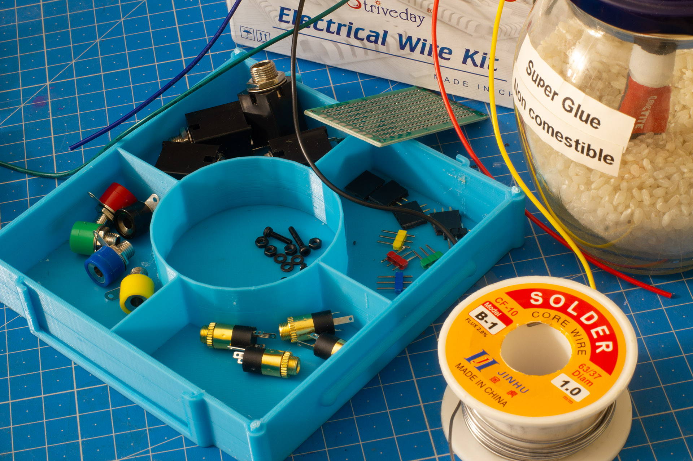
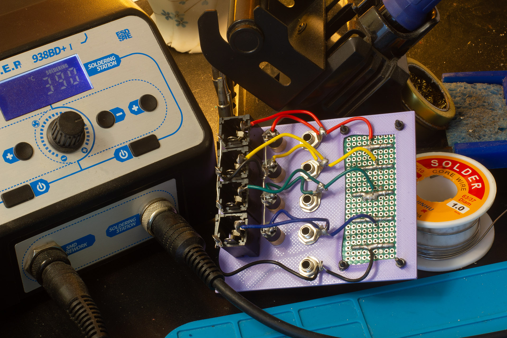

Passive Multiple Adapter for 6.35mm and 3.5mm jacks, Banana Plugs and DuPont Headers
====================================================================================

A useful little tool for Synth DIY enthusiasts! This little box allows me to convert between the five types of connectors I use the most in my shop.

License: CC-BY-NC-SA 4.0. 

I've been getting into building DIY synthesizers recently, and way too often, I find myself needing alligator clips to make two types of connectors talk to each other. So I've decided to build a little box to connect together my most used connector types: DuPont line, Banana connectors, and audio jacks big and small.

Here's step-by-step instructions how to build it:

## Bill of Materials

You need:

- A 7cm × 3cm perfboard (common size, easily found on Aliexpress)
- Some M2 screws, nuts, and washers to hold the perfboard, or some Super Glue if you prefer
- Male and female 0.1 inch headers, and a tool to cut them to size
- 4 small audio jacks
- 4 big audio jacks (body no wider than 16mm)
- 5 banana connectors
- wire and soldering supplies

## Building

First, print both the `Box.stl` and the `Top Plate.stl`. If you know you will never use Banana connectors, print instead `Top Plate (No Ground Connector).stl`: you can use twice as many small jacks, the holes are the same size, and you don't need an additional hole for the ground with jacks. The files include enough tolerances to account for thermal expansion and bridge droop, and should be printed at 100% size.

I recommend printing the top plate with PETG for solidity and compliance, but the item won't bend that much in use, so PLA should work fine too. Use 100% infill for the top plate.

For the box, use whatever filament or infill you want. No need for supports. 

Note that in my sample print in the photo, in my slicer, I enabled ironing of top surfaces, and fuzzy skin on parts of the outer shell.

Assemble everything on the front plate.

The position of screw holes seems different across batches of PCBs, so if the board you have won't fit the holes, you can just use super glue, or you can, like I did, use a heat gun to slide the hole around a little—it will look messy on the back, but invisible on the front. 

To keep the headers from moving while soldering them, I like to use cheap modelling clay wrapped in a sheet of plastic, then I solder a single pin, and check if the header needs adjustment.

After that, it's a simple matter of connecting each row together, and all the grounds together. You don't need a schematic to do that! No need to make it more tidy than necessary. We're not making audiophile toys here, we're making test equipment for punk elektronix. 

Use a multimeter to check for continuity and short-circuits. 

Optionally, if you're confident your build is correct, use super glue before sliding the cover into the rails. (Protip: store your super glue upright in a jar of rice like I do and it will last forever).

It's ready to use! Let me know if you find it useful.

_Note: as this item was designed as a one-off using both FreeCAD and Blender boolean operations, the source files were not kept parametric and easily editable, so they are not provided: it'd be easier to modify the STLs directly if you have ideas for mods._

— Aria Salvatrice