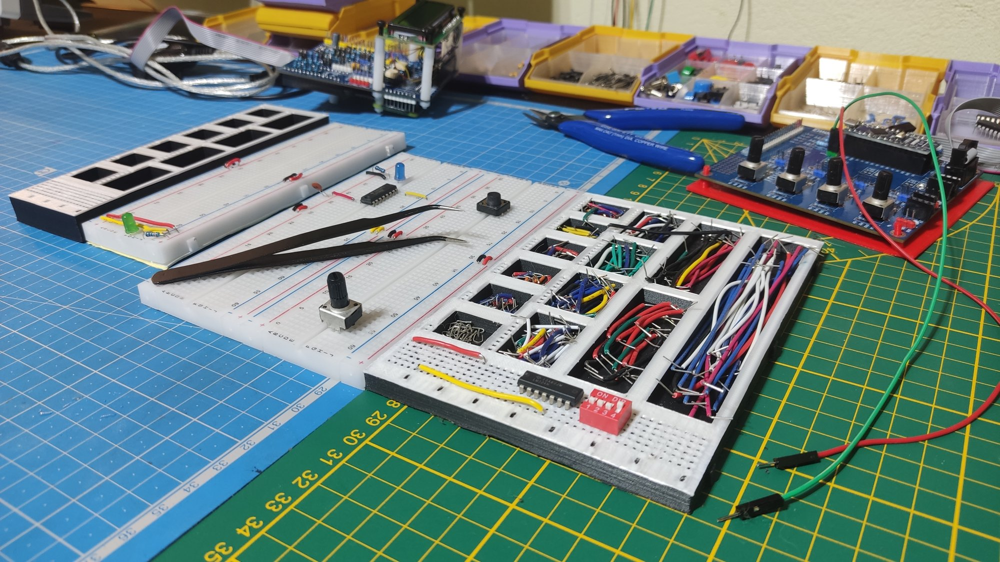
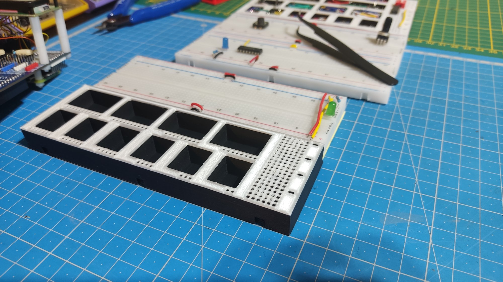

# Tileable Breadboard Wire Tray

A tray for your leads, sorted by size, with little rulers on the side. It's the same size as breadboards, and has notches to tile with them.

License: CC-BY-NC-SA 4.0.

The first two columns have compartments for leads sized from 1 pin to 10 pins, with a ruler on the size to measure quickly. Past those sizes, I find it less crucial to have perfect measurements. All the compartments should be big enough to grab stuff with your fingers, if so inclined. There's also a bunch of holes in the bottom, you can use them as parking space, or as a small soldering jig.

There is no real standard in breadboard dimensions, but this was designed to fit the common cheapo plastic 830 points breadboard you can find all over Aliexpress. It should be easy to make the notches on the tray snap with the holes on a breadboard, but to fasten the holes on the tray to a breadboard, you might need to enlarge the holes, or to use a bit of adhesive help.

The variants provided are:

- `Tileable Breadboard Wire Tray - Low Height - Small.stl` - 2 columns, as wide and as tall as 1 breadboard. The compartments are not very deep so you can't store much.
- `Tileable Breadboard Wire Tray - Low Height - Wide.stl` - 4 columns, as wide and as tall as 2 breadboards. The compartments are not very deep so you can't store much.
- `Tileable Breadboard Wire Tray - Tall - Small.stl` - 2 columns, as wide as 1 breadboard but taller. Deeper compartments are more useful.
- `Tileable Breadboard Wire Tray - Tall - Wide.stl` - 4 columns, as wide as 2 breadboards but taller. Deeper compartments are more useful.

I recommend picking one of the **Tall** variants. Low infill will be enough (I like 20% gyroid). Using a brim would be a good idea. No supports required, obviously. A color change for the top layers is a good idea. Ironing the topmost layer gives messy results in the ruler area, I advise against it.

This item was thrown together with [CadQuery](https://cadquery.readthedocs.io/). While the source is provided, you will find it difficult to edit, as I didn't attempt to do it clean. But you are very welcome to edit this items by any means you prefer.

— Aria Salvatrice
